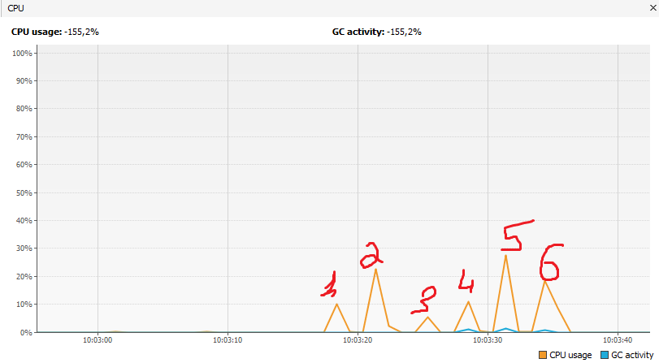
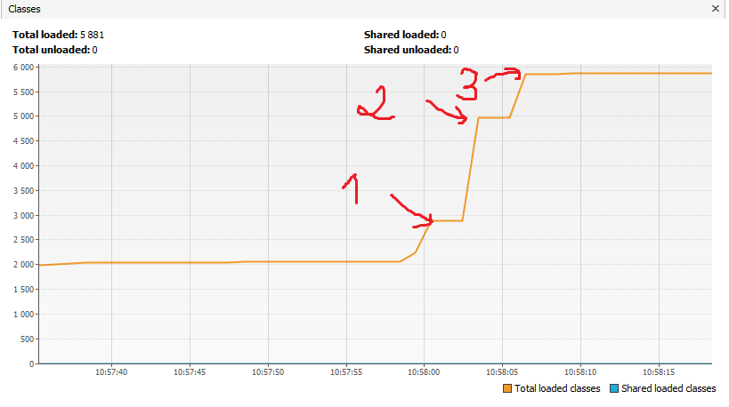
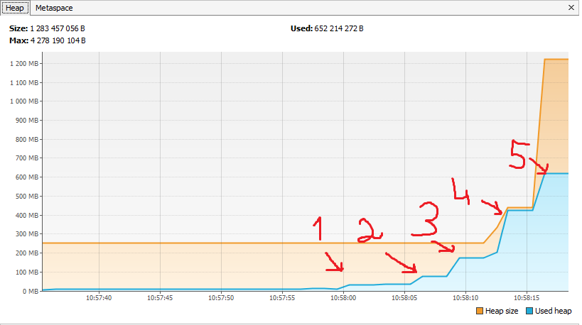
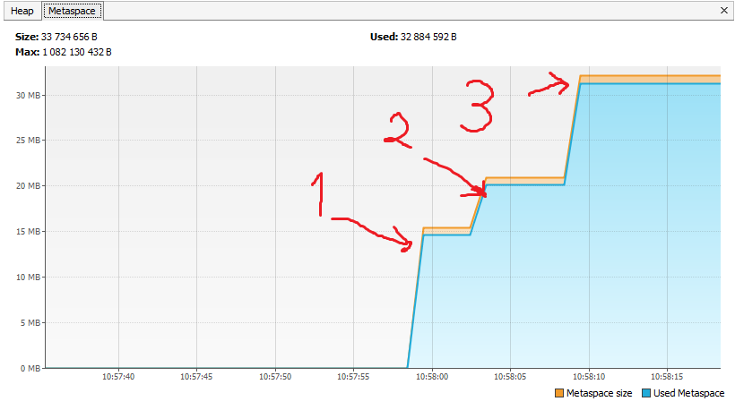

# Задача "Исследование JVM через VisualVM"

****
График потребления CPU
****

- Оранжевая линия показывает процесс потребления CPU нашей программой,
  в пиковые значения происходит большое количество создания объектов
- Синяя линия показывает потребления CPU garbage collection,
  небольшие пики происходят три раза. 
 1.loaded 529 classes
 2.loaded 2117 classes
 3.loaded 869 classes
 4.creating 5000000 objects
 5.creating 5000000 objects
 6.creating 5000000 objects 
****
График Classes
****

- За время работы программы было создано 5881 класса
1. loaded 529 classes.  
2. loaded 2117 classes. 
3. loaded 869 classes.
****
График Heap
****

- размер heap(куча) изнчально был выделен 250 mb, но по мере увелечения количества
объектов heap(куча) былы увеличена первый раз до 450 mb достиг пик, второй раз пик 
достиг 1250 mb

1. loaded 529 classes
2. loaded 2117 classes
3. loaded 869 classes.Увеличение пямяти под heap(куча) до 450 mb
4. creating 5000000 objects. Увеличение пямяти под heap(куча) до 1250 mb
5. creating 5000000 objects
****
График Metaspace
****

1. loaded 529 classes. Размер Metaspace больше 15 mb  
2. loaded 2117 classes. Размер Metaspace больше 25 mb
3. loaded 869 classes. Размер Metaspace больше 30 mb